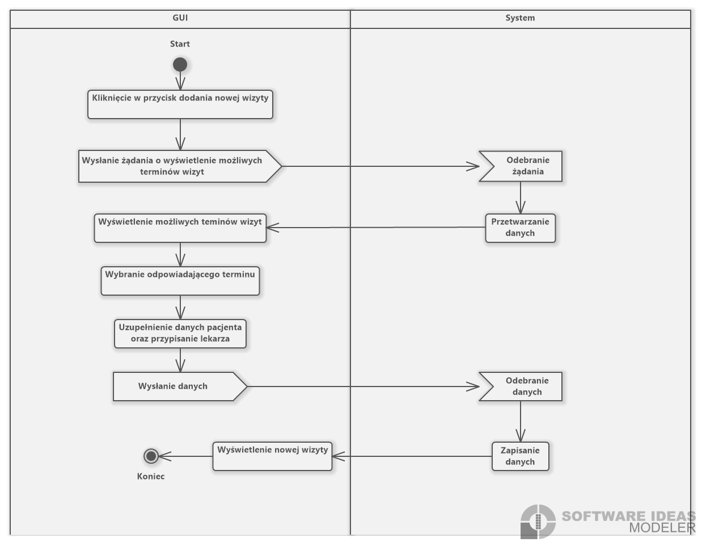
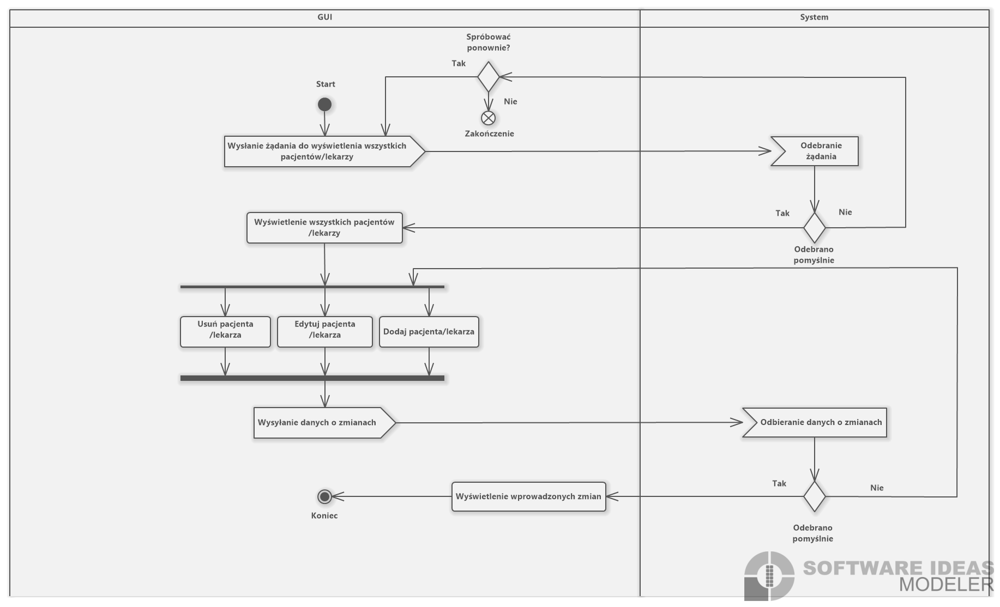
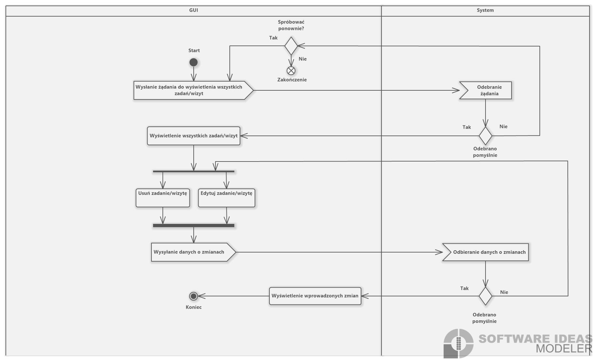
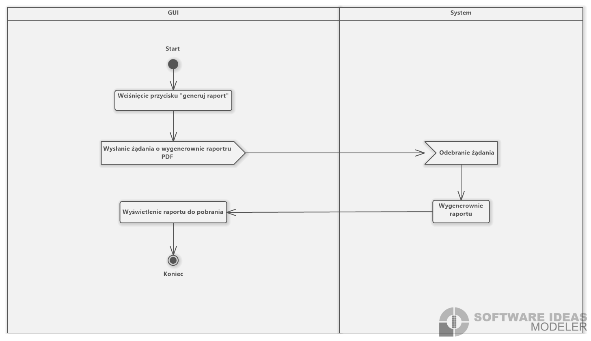
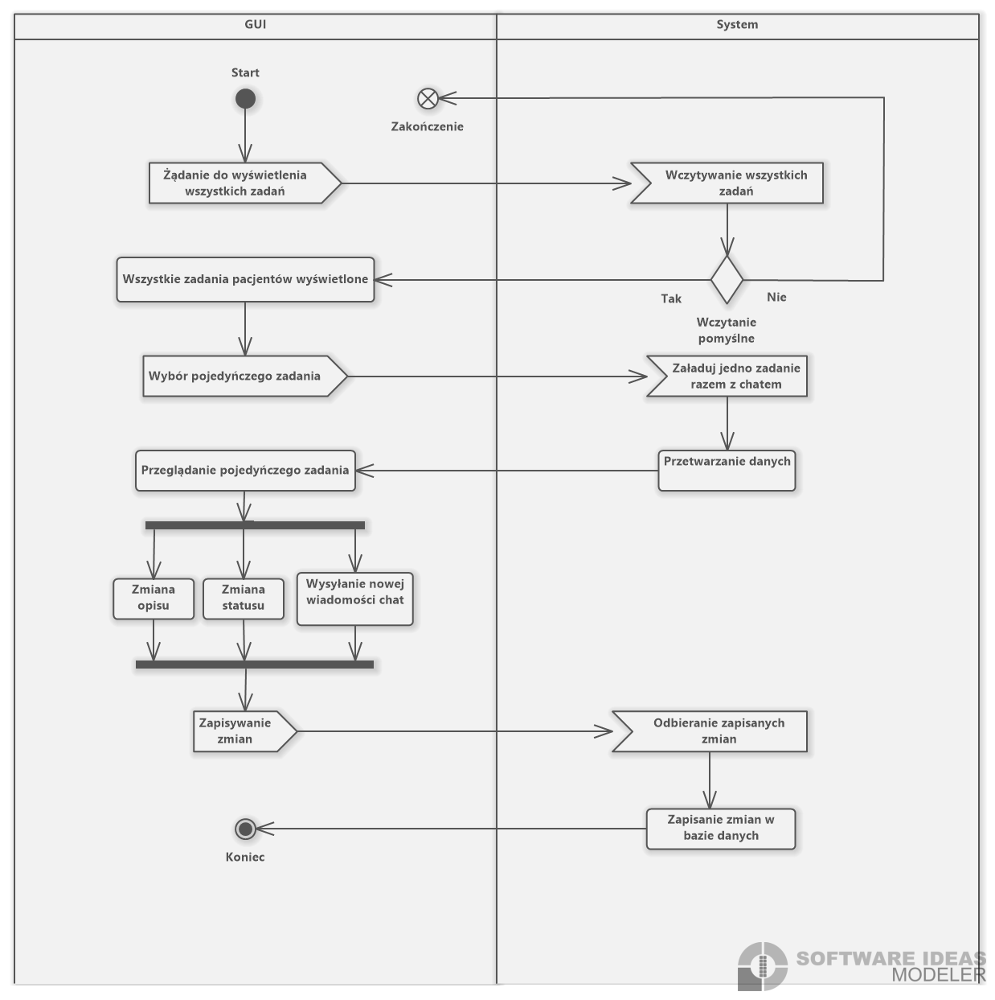
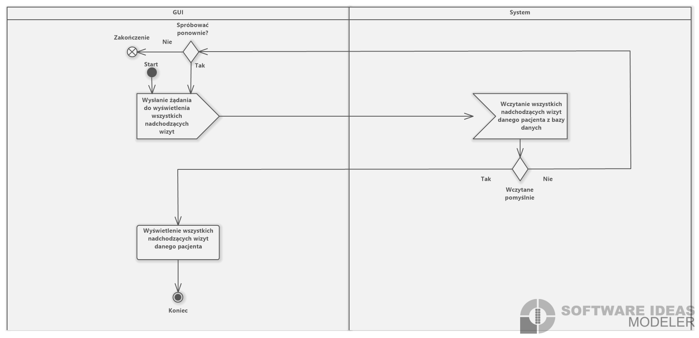
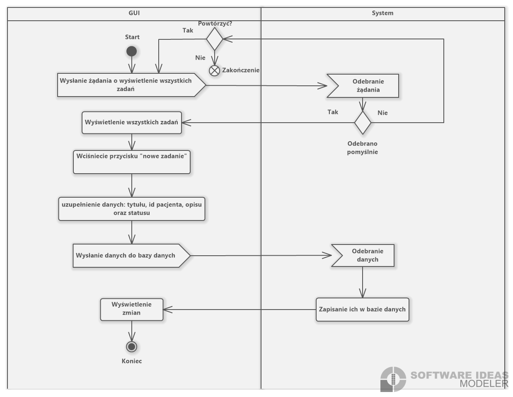

Programowanie zespołowe laboratorium _**3**_ grupa _**3**_

# Dokumentacja projektu: \*\*System do zarządzania zadaniami w centrum medycznym pomiędzy lekarzami a pacjentami

## Zespoł projektowy:

<ul>
<li>Karol Saj <b>(Team Leader)</b></li>
<li>Karol Wereski</li>
<li>Bartosz Słowik</li>
<li>Agata Sowa</li>
<li>Dawid Koncewicz</li>
<li>Krzysztof Lech</li>
</ul>

## Cel projektu

Rozwijanie umiejętności programowania zespołowego w metodyce scrum i poznanie metod skutecznej komunikacji za pomocą narzędzi programowania.

## Zakres projektu

## ## Opis programu / systemu i wymagania

- System powinien mieć kilka modułów

  - Moduł zadań i wizyt
  - Moduł administracji użytkownikami (role)
    - Grupa Administratorów
    - Grupa Lekarzy
    - Grupa Pacjentów
    - Grupa Rejestratorów medycznych
  - Moduł raportów
  - Lekarz: Generowanie raportu Pacjenta
  - Lekarz/Administrator: Generowanie raportu użytkowników: przypisanych Lekarzy i Pacjentów
  - Rejestratorzy medyczni: Generowanie loginów i haseł nowych pacjentów
  - Generowanie raportów w formie PDF
  - Moduł konfiguracji
    - Ustawienia Dark mode interfejsu użytkownika

- Aplikacja będzie wspópracować z bazą danych MySQL

## Panele / zakładki systemu, które będą oferowały potrzebne funkcjonalności

- Panel administratora
  - Przeglądanie/Dodawanie/Usuwanie/Edycja Lekarzy, Pacjentów
  - Przeglądanie/Usuwanie zadań/wizyt
- Panel lekarzy
  - Przeglądanie/Dodawanie/Modyfikacja zadań/wizyt w ramach modułu
  - Dostęp do chatu zadania
- Panel pacjenta
  - Przeglądanie zadań/wizyt
  - Dostęp do chatu zadania
- Panel rejestratora medycznego
  - Dodawanie Lekarzy/Pacjentów
  - Dodawanie wizyt

Każde zadanie posiada własny chat w ramach modułu zadań.

- Zakładka raportów
  - Pacjent: Raport Nadchodzących wizyt
  - Administrator, rejestracja, Lekarz: Raport pacjenta (wizyty i zadania)
  - Administrator i rejestracja: Raport pacjenta (wizyty i zadania)
  - Administrator i rejestracja: Lista lekarzy i przypisanych pacjentów
  - Rejestrator medyczny: Generowanie hasła pacjenta do systemu po przejsciu formularza rejestracji pacjenta

## Typy wymaganych dokumentów w projekcie oraz dostęp do nich

- Raporty PDF
  - Pacjent: Raport Nadchodzących wizyt
  - Administrator, rejestracja, Lekarz: Raport pacjenta (wizyty i zadania)
  - Administrator i rejestracja: Raport pacjenta (wizyty i zadania)
  - Administrator i rejestracja: Lista lekarzy i przypisanych pacjentów
  - Rejestrator medyczny: Generowanie hasła pacjenta do systemu po przejsciu formularza rejestracji pacjenta

## Przepływ informacji w środowisku systemu

Scentralizowany oparty na bazie danych MySQL

## Interesariusze

- Interesariusze wewnętrzni
  - Lekarze, którzy używają aplikacji do zarządzania zadaniami pacjentów i komunikowania się z pacjentami
  - Administratorzy centrum medycznego do administrowania i kontroli działania placówki medycznej
- Interesariusze zewnętrzni
  - Pacjenci, którzy używają aplikacji do zarządzania zadaniami związanymi z opieką zdrowotną i komunikowania się z lekarzami

## Użytkownicy aplikacji i ich uprawnienia

### Pacjenci:

Przypadki użycia:

- Przeglądanie nadchodzących wizyt
- Korzystanie z modułu zadań i chatu:
  - Raportowanie przydzielonych zadań za pomocą chatu
  - Raportowanie stanu zdrowia lekarzowi za pomocą chatu
  - Otrzymywanie informacji zwrotnej i instrukcji od lekarza za pomocą chatu

Działania:

1. Przeglądanie wizyt: Pacjent przegląda nadchodzące wizyty zaplanowane przez Lekarza.
2. Wykonywanie zadań: Pacjent wykonuje zadania przydzielone przez lekarza, takie jak wypełnianie formularzy zdrowotnych, zażywanie leków lub wykonywanie ćwiczeń itp..
3. Raportowanie stanu zdrowia: Pacjent opisuje swój stan zdrowia lekarzowi na żądanie, takie jak zgłaszanie objawów lub postępu w leczeniu za pomocą chatu.
4. Otrzymywanie informacji zwrotnej i instrukcji: Pacjent otrzymuje informacje zwrotne od lekarza na temat wykonanych zadań, a także instrukcje dotyczące nowych zadań lub zmian w leczeniu za pomocą chatu.

Sekwencja użycia chatu :

1. Lekarz tworzy zadanie wraz z opisem zadania udostępniając w ten sposób chat zadania.
2. Pacjent otrzymuje nowe zadanie przydzielone przez lekarza.
3. Pacjent przegląda opis zadania i rozpoczyna jego wykonywanie.
4. Pacjent poprzez chat dodaje wszelkie niezbędne uwagi związane z wykonaniem zadania lub komentarze.
5. Pacjent wysyła wiadomości do lekarza, aby zgłosić problemy lub poprosić o pomoc.
6. Lekarz przegląda stan zadania i udziela informacji zwrotnej lub dalszych instrukcji.
7. Lekarz kończy zadanie i oznacza je jako wykonane.

### Lekarze:

Przypadki użycia:

- Dodawanie wizyt
- Przydzielanie zadań pacjentom
- Przeglądanie postępu i stanu zadań pacjentów
- Komunikacja z pacjentami w sprawie zadań i wizyt za pomocą chatu

Działania:

1.  Planowanie wizyt: Lekarz dodaje nowe wizyty
2.  Przydzielanie zadań: Lekarz przypisuje zadania do pacjentów na podstawie ich potrzeb takich jak zażywanie leków lub wykonywanie ćwiczeń.
3.  Monitorowanie postępu zadań: Lekarz monitoruje postęp zadań pacjentów za pomocą chatu zadań i aktualizuje statusy zadań

Sekwencje:

1. Lekarz tworzy zadanie wraz z opisem zadania udostępniając w ten sposób chat zadania.
2. Pacjent otrzymuje nowe zadanie przydzielone przez lekarza.
3. Pacjent przegląda opis zadania i rozpoczyna jego wykonywanie.
4. Pacjent poprzez chat dodaje wszelkie niezbędne uwagi związane z wykonaniem zadania lub komentarze.
5. Pacjent wysyła wiadomości do lekarza, aby zgłosić problemy lub poprosić o pomoc.
6. Lekarz przegląda stan zadania i udziela informacji zwrotnej lub dalszych instrukcji.
7. Lekarz kończy zadanie i oznacza je jako wykonane.

### Administrator:

Przypadki użycia:

- Przeglądanie/Dodawanie/Usuwanie/Edycja Lekarzy, Pacjentów
- Przeglądanie/Usuwanie zadań/wizyt

Działania:

- Zarządzanie Lekarzami, Pacjentami, Zadaniami i Wizytami
- Generowanie raportów istniejących pacjentów i przypisanych lekarzy
- Generowanie pliku pdf z danymi zarejestrowanego użytkownika

### Rejestrator medyczny:

Przypadki użycia:

- Dodawanie pacjentów
- Dodawanie wizyt

Działania:

- Rejestrowanie Lekarzy i Pacjentów

Sekwencja formularza rejestracji pacjenta:

1. Rejestrator medyczny uzupełnia dane osobowe potencjalnego pacjenta i tworzy go.
2. Rejestrator przypisuje lekarza z listy lekarzy
3. Rejestrator rejestruje pierwszą wizytę
4. Lekarz otrzymuje możliwość dopisywania wizyt i zadań do nowego użytkownika

5. Administrator generuje pliku pdf z danymi zarejestrowanego użytkownika wraz z hasłem
6. Pacjent otrzymuje dostęp do konta z danymi z pliku pdf

## Wymagania funkcjonalne

- Generowanie raportów w formie pdf
- Uwierzytelnianie za pomocą pary: login, hasło
- Podział na grupy użytkowników, zarządzany przez administratora
- System zakładek interfejsu użytkownika zgodny z określonymi przypadkami użycia i dostępnymi działaniami dla danej grupy użytkownika.

## Wymagania niefunkcjonalne

- Możliwość zmiany kolorystyki interfejsu na tzw. Dark mode
- Wykorzystanie bazy danych MySQL i HibernateORM
- Interfejs graficzny ma zostać wykonany w JavaFx
- Hashowanie haseł

## Diagramy UML

###### [Diagram przypadków użycia]

   

###### [Diagram aktywności]

### Diagram aktywności dodawania pacjentów przez rejestratora medycznego

  

### Diagram aktywności dodawania wizyt przez lekarza oraz rejestratora medycznego

  

### Diagram aktywności przeglądania/dodawania/usuwania/edycji lekarzy i pacjentów przez administratora

  

### Diagram aktywności przeglądania/usuwania/edycji zadań/wizyt przez administratora

  

### Diagram aktywności generowania raportu przez każdego

  

### Diagram aktywności komunikacji z pacjentami w sprawie zadań i wizyt za pomocą chatu przez lekarza

  

### Diagram aktywności korzystania z modułu zadań i chatu przez pacjenta

  

### Diagram aktywności przeglądania stanu zadań pacjentów przez lekarza

  

### Diagram aktywności przeglądania wizyt przez pacjenta

  

### Diagram aktywności przydzielania zadań przez lekarza

  

- ###### [Diagram sekwencji]
  Wstawić rys. diagramu UML
- ###### [Diagram klas]
  Wstawić rys. diagramu UML

## Baza danych

###### Diagram ERD

###### Skrypt do utworzenia struktury bazy danych

###### Opis bazy danych

## Wykorzystane technologie

- Język Java 17
  - JavaFX
  - Hibernate ORM
- Baza danych MySQL
- Inne z opisem

## Pliki instalacyjne wraz z opisem instalacji i konfiguracji wraz pierwszego uruchomienia
